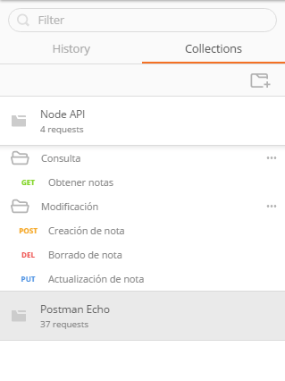

# Course Checkpoint 6. Preguntas teóricas


## 1.¿Para qué usamos Clases en Python?


Una clase en Python es una estructura de programación que permite definir un conjunto de métodos y atributos que describen un objeto o entidad. Las clases son un concepto fundamental en la programación orientada a objetos (POO o OOP en inglés), que se utilizan para modelar entidades del mundo real o abstracto en un programa de computadora. En ese sentido, constituyen una metodología que permite organizar y estructurar el código de una manera más eficiente y modular.

Cosas comunes en la vida diaria, como un perro o un coche, pueden ser representadas con clases. Estas clases tienen diferentes características, que en el caso del perro podrían ser la edad, el nombre o la raza. Llamaremos a estas características "atributos".

Por otro lado, las clases tienen un conjunto de funcionalidades o acciones que pueden realizar. En el caso del perro, podrían ser caminar o ladrar. Llamaremos a estas funcionalidades "métodos".

Por último, pueden existir diferentes instancias de perro. Podemos tener uno que se llame Toby o el del vecino que se llame Laika. Llamaremos a estas diferentes instancias de perro "objetos". Es decir, el concepto abstracto de perro es la clase, pero Toby o cualquier otro perro particular será un objeto.

En el contexto de la programación orientada a objetos, uno de los primeros mecanismos creados fueron las funciones, que permiten agrupar bloques de código que realizan una tarea específica bajo un nombre. Es muy útil, ya que también permite reutilizar esos módulos o funciones sin tener que copiar todo el código, solo la llamada.

Sin embargo, las funciones resultaron limitadas en ciertos aspectos. Una de sus limitaciones es que sólo realizan operaciones con datos de entrada para entregar una salida, sin mantener ningún estado. Salvo que se devuelva un valor en la llamada a la función o se usen variables globales, todo lo que sucede dentro de la función queda olvidado, lo que puede ser problemático en algunos casos.

Imaginemos que tenemos un juego con naves espaciales moviéndose por la pantalla. Cada nave tiene una posición (x, y) y otros parámetros como el tipo de nave, su color o tamaño. Sin hacer uso de clases y POO, tendríamos que tener una variable para cada dato que queremos almacenar: coordenadas, color, tamaño, tipo. El problema viene si tenemos 10 naves, ya que nos podríamos encontrar con un número muy elevado de variables. 

En respuesta a estos problemas, surgió la programación orientada a objetos. Es una herramienta perfecta que permite resolver ciertos tipos de problemas de una manera mucho más sencilla, con menos código y más organizado. Tal y como se mencionó con anterioridad, su utilidad radica en agrupar bajo una clase un conjunto de variables y métodos que pueden ser reutilizados con características particulares creando objetos.


### Creando Clases


Hasta ahora, sabemos que una clase define una plantilla o molde para crear objetos, los cuales son instancias de esa clase. Podemos pensar en la clase como el molde con el que se crean nuevos objetos de ese tipo, a modo gráfico, seria algo así:


En el proceso de diseño de una clase hay que tener en cuenta – entre otros – el [principio de responsabilidad única](https://es.wikipedia.org/wiki/SOLID), intentando que los atributos y los métodos que contenga esa clase estén enfocados a un _objetivo único y bien definido_.


Los objetos creados a partir de una clase tienen las mismas propiedades y comportamientos definidos por la clase, pero pueden tener valores diferentes para los atributos que se definen en la clase.

En Python, una clase se define mediante la palabra clave «class», seguida del nombre de la clase y dos puntos (:) y luego el cuerpo de la clase. El cuerpo de la clase contiene definiciones de métodos y atributos, que pueden ser públicos o privados según su acceso. Por ejemplo:
```Python
class Persona:
    def __init__(self, nombre, edad):
        self.nombre = nombre
        self.edad = edad

    def saludar(self):
        print("Hola, mi nombre es " + self.nombre)
```

  **Consejo**
  >Los nombres de clases se suelen escribir en formato CamelCase y en singular.


### Atributos en las clases de Python

Un atributo es una variable que se define dentro de una clase, la cual almacena datos que pertenecen a un objeto de esa clase. Los atributos se utilizan para representar características o propiedades de un objeto, como su estado actual, su identificador, su tamaño, su color, etc.

Los atributos pueden ser de diferentes tipos de datos, como enteros, flotantes, cadenas, listas, diccionarios, entre otros. Además, los atributos pueden tener distintos niveles de visibilidad, que se especifican mediante los modificadores de acceso en la definición de la clase. Por defecto, los atributos son públicos en Python, lo que significa que puede accederse a ellos desde cualquier lugar del programa.

En la definición de una clase, los atributos se definen como variables que se inicializan en el método especial __init__. Por ejemplo, en la clase Persona que definimos anteriormente, los atributos «nombre" y «edad» se definen de la siguiente manera:
```Python
class Persona:
    def __init__(self, nombre, edad):
        self.nombre = nombre
        self.edad = edad
```
En este caso, «nombre» y «edad» son atributos públicos de la clase Persona, que se inicializan con los valores proporcionados al crear un objeto de la clase. Para acceder a los atributos de un objeto de la clase, se utiliza la notación de punto (.), seguida del nombre del atributo. Por ejemplo, para acceder al atributo «nombre» de un objeto «persona1» de la clase Persona, se utiliza el siguiente código:
```Python
nombre_persona1 = persona1.nombre
```
En Python, los atributos de una clase pueden tener diferentes niveles de visibilidad, que se especifican mediante los modificadores de acceso en la definición de la clase. Los tres tipos principales de atributos son:

- Atributos públicos: se puede acceder a ellos desde cualquier parte del programa, incluso desde fuera de la clase. En Python, los atributos se consideran públicos por defecto, lo que significa que no se requiere ningún modificador de acceso para especificar que un atributo es público. Para acceder a un atributo público, se utiliza la notación de punto (.) seguida del nombre del atributo.

- Atributos privados: solo se puede acceder a ellos desde dentro de la clase en la que se definen. En Python, los atributos privados se definen mediante el prefijo «__» seguido del nombre del atributo. Por ejemplo, si queremos definir un atributo privado llamado «saldo» en una clase llamada CuentaBancaria, podemos hacerlo de la siguiente manera:

```Python
class CuentaBancaria:
    def __init__(self, saldo):
        self.__saldo = saldo
```
En este caso, «__saldo» es un atributo privado de la clase CuentaBancaria, que solo se puede acceder a él desde dentro de la clase. Si intentamos acceder a este atributo desde fuera de la clase se producirá un error.

- Atributos protegidos: Aunque no existe un modificador de acceso protegido como en otros lenguajes, se utiliza una convención de prefijo `_` para indicar que un atributo está protegido. Esto significa que solo se debe acceder a ellos desde dentro de la clase en la que se definen y desde las clases derivadas (heredadas).
  

#### Métodos para las clases de Python

En Python, los métodos son funciones que se definen dentro de una clase y se utilizan para realizar operaciones en los objetos creados a partir de esa clase. Los métodos se definen de la misma manera que las funciones, pero siempre tienen como primer parámetro el objeto al que se aplicará el método, que suele llamarse «self» por convención.

Por ejemplo, si queremos definir una clase llamada CuentaBancaria que tenga un método para depositar dinero en la cuenta, podemos hacerlo de la siguiente manera:
```Python
class CuentaBancaria:
    def __init__(self, saldo):
        self.saldo = saldo

    def depositar(self, cantidad):
        self.saldo += cantidad
```
En este ejemplo, la clase CuentaBancaria tiene un método llamado «depositar» que toma como parámetro la cantidad de dinero a depositar en la cuenta y actualiza el saldo de la cuenta en consecuencia.

Para utilizar un método de una clase, primero debemos crear un objeto a partir de esa clase y luego llamar al método sobre ese objeto. Por ejemplo, para crear una instancia de la clase CuentaBancaria y depositar $100 en la cuenta, podemos hacer lo siguiente:
```Python
cuenta = CuentaBancaria(0)
cuenta.depositar(100)
```
En este caso, primero creamos una instancia de la clase CuentaBancaria con un saldo inicial de cero, y luego llamamos al método «depositar» sobre esa instancia para depositar $100 en la cuenta.

### El objeto self

Como mencionamos, en Python, «self» es una convención que se utiliza como nombre para el primer parámetro de un método en una clase. El objetivo de «self» es hacer referencia al objeto que se está manipulando cuando se llama al método.

Cuando se llama a un método sobre un objeto en Python, el intérprete automáticamente asigna una referencia a ese objeto al parámetro «self» del método. De esta forma, dentro del cuerpo del método podemos acceder a los atributos y métodos del objeto utilizando «self» como prefijo.

Por ejemplo, si tenemos una clase llamada «Persona» con un método «saludar» que imprime un saludo personalizado, podemos definir el método de la siguiente forma:
```Python
class Persona:
    def __init__(self, nombre):
        self.nombre = nombre

    def saludar(self):
        print("Hola, mi nombre es", self.nombre)

```
En este caso, el método saludar toma como primer parámetro self, que hace referencia al objeto de la clase Persona, sobre el cual se está llamando al método. Dentro del cuerpo del método podemos acceder al atributo «nombre» del objeto utilizando self.nombre. Cuando llamamos al método saludar sobre un objeto de la clase Persona, el intérprete automáticamente asigna una referencia a ese objeto al parámetro self. Por ejemplo:
```Python
p = Persona("Juan")
p.saludar()  # Imprime "Hola, mi nombre es Juan"
```

A diferencia de otros lenguajes de POO, todos los métodos y atributos en Python son públicos. Es decir, no es posible definir una variable como private o protected.

### Utilidad de las Clases en Python

- Abstracción y organización del código: Las clases permiten agrupar datos y funcionalidades relacionadas en una sola entidad, lo que facilita la comprensión y el mantenimiento del código.
- Reutilización de código: Al definir una clase, puedes crear instancias de esa clase en múltiples partes de tu programa, evitando así la repetición de código y promoviendo la modularidad.
- Encapsulamiento: Las clases permiten ocultar detalles de implementación y exponer solo la interfaz necesaria para interactuar con los objetos. Esto ayuda a reducir la complejidad y a prevenir modificaciones accidentales en el código.
- Herencia: Python soporta la herencia, lo que significa que puedes crear nuevas clases basadas en clases existentes, reutilizando así su funcionalidad y extendiéndola según sea necesario.

  
### Desventajas del uso de las clases en Python

- Sobrecarga de complejidad: Las clases pueden agregar complejidad adicional a un programa y hacer que sea más difícil de entender y depurar.
- Curva de aprendizaje: El aprendizaje de las clases y la programación orientada a objetos en general pueden requerir una curva de aprendizaje más pronunciada para los programadores principiantes.
- Uso innecesario: A veces, las clases se utilizan innecesariamente en situaciones en las que una función simple podría haber hecho el trabajo de manera más eficiente.

### Buenas Prácticas al Usar Clases en Python:

- Nombrado descriptivo: Elige nombres descriptivos para tus clases que indiquen claramente su propósito y función.
- Divide y conquista: Si una clase se vuelve demasiado grande o compleja, considera dividirla en clases más pequeñas y especializadas, siguiendo el principio de responsabilidad única.
- Encapsulación adecuada: Utiliza los modificadores de acceso (public, private, protected) para controlar el acceso a los atributos y métodos de la clase, evitando así el acceso no autorizado o la dependencia excesiva entre clases.

## 2. ¿Qué método se ejecuta automáticamente cuando se crea una instancia de una clase?

El método `__init__` es un método dunder (_doble underscore_) que se usa para inicializar un objeto cuando se crea una instancia de una clase. También se conoce como **constructor** y se usa para asignar valores iniciales a los atributos de una instancia de la clase. Los atributos son las variables que pertenecen a una instancia particular de la clase. Al llamar al método `__init__`, podemos establecer los valores de estos atributos y configurar la instancia de la clase para su uso posterior.

Sintaxis:
```Python
def __init__(self, [parámetros]):
    [algoritmo]
```
Como se puede apreciar, se define el método __init__ (es decir utilizamos dos caracteres de barra baja, la palabra _init_ y seguidamente otros dos caracteres de barra baja).

Por ejemplo, supongamos que queremos crear una clase llamada _Persona_ con dos atributos: nombre y edad. Podríamos definir la clase de la siguiente manera:
```python
class Persona:
    def __init__(self, nombre, edad):
        self.nombre = nombre
        self.edad = edad

    def saludar(self):
        print(f"Hola, soy {self.nombre} y tengo {self.edad} años.")

# Creando una instancia de la clase Persona
juan = Persona("Juan", 30)
```
En este ejemplo, cuando se crea la instancia _juan_ de la clase Persona, se llama automáticamente al método `__init__()`, pasando los argumentos "Juan" y 30 para inicializar los atributos nombre y edad de la instancia juan.

El objetivo fundamental del método `__init__` es inicializar los atributos del objeto que se crea.

Las ventajas de implementar el método __init__  son:

- El método `__init__` es el primer método que se ejecuta cuando se crea un objeto.
- El método `__init__` se llama automáticamente, por lo que es imposible olvidarse de llamarlo.
- Quien utiliza POO en Python conoce el objetivo de este método.


Otras características importantes del método __init__ son:

- El método `__init__` no puede retornar un valor.
- El método `__init__` puede recibir parámetros que se utilizan para inicializar atributos. Estos parámetros son opcionales y permiten especificar los valores iniciales de los atributos al momento de la instanciación.
- El método `__init__` es opcional, pero es muy común declararlo. Si no se define un constructor, la clase hereda uno que únicamente recibe el argumento `self`.
- A diferencia de otros lenguajes como Java, en Python solo se puede definir un único constructor.


A continuación, otro ejemplo del constructor bajo las premisas señaladas, en el caso de tarjetas de crédito:
```python
class Tarjeta:
    def __init__(self, id, cantidad=0):
        self.id = id
        self.saldo = cantidad

    def mostrar_saldo(self):
        print('El saldo es', self.saldo, '€')

t = Tarjeta('1111111111', 1000)
t.mostrar_saldo()  # Imprime "El saldo es 1000 €"
```

### Atributos de instancia vs atributos de clase

Los atributos que se crean dentro del método `__init__` se conocen como atributos del objeto, mientras que los que se crean fuera de él se conocen como atributos de la clase. Mientras que los primeros son propios de cada objeto y por tanto pueden tomar valores distintos, los valores de los atributos de la clase son los mismos para cualquier objeto de la clase. En general, no deben usarse atributos de clase, excepto para almacenar valores constantes. Por ejemplo:
```python
class Circulo:
    pi = 3.14159  # Atributo de clase

    def __init__(self, radio):
        self.radio = radio  # Atributo de instancia

    def area(self):
        return Circulo.pi * self.radio ** 2

c1 = Circulo(2)
c2 = Circulo(3)
print(c1.area())  # Imprime "12.56636"
print(c2.area())  # Imprime "28.27431"
print(c1.pi)  # Imprime "3.14159"
print(c2.pi)  # Imprime "3.14159"
```

En general, el uso de constructores en la POO permite una inicialización más controlada y consistente de los objetos. Ayuda a evitar errores y facilita el uso de los objetos.

Ademas, una de las ventajas del método constructor en Python es que nos brinda flexibilidad a la hora de crear objetos. Podemos definir un constructor con diferentes parámetros y utilizarlos según nuestras necesidades. Esto nos permite crear objetos con valores predefinidos, pero también nos da la posibilidad de crear objetos sin especificar valores iniciales, dejando los atributos en su estado por defecto.

Es importante destacar que el método constructor puede contener cualquier tipo de código, como asignaciones de valores a los atributos, llamadas a otros métodos de la clase o incluso acciones externas, como lectura de archivos o conexiones a bases de datos. Esto nos permite realizar cualquier acción necesaria para inicializar correctamente el objeto antes de que sea utilizado en el programa.

Por otro lado, cabe  destacar tambien que el método constructor en Python puede ser sobrescrito en una clase hija. Esto significa que si una clase hija tiene un método constructor propio, se ejecutará en lugar del método constructor de la clase padre. Esto permite personalizar la inicialización de los atributos en la clase hija y agregar cualquier código adicional que sea necesario.

Supongamos que tenemos una clase base llamada Vehiculo con un constructor que inicializa el atributo marca:
```Python
class Vehiculo:
    def __init__(self, marca):
        self.marca = marca


# Ahora creamos una clase hija llamada `Auto` que hereda de `Vehiculo`:
class Auto(Vehiculo):
    def __init__(self, marca, modelo):
        # Llamamos al constructor de la clase base usando `super()`
        super().__init__(marca)
        self.modelo = modelo


# Creamos una instancia de `Auto`:
mi_auto = Auto(marca="Toyota", modelo="Corolla")
print(f"Marca: {mi_auto.marca}, Modelo: {mi_auto.modelo}")

#El resultado será: Marca: Toyota, Modelo: Corolla
```

En este ejemplo:
- La clase Auto hereda de Vehiculo.
- El constructor de Auto toma dos argumentos (marca y modelo).
- Usamos super().`__init__(marca)` para llamar al constructor de la clase base y establecer la marca.
- Luego, inicializamos el atributo modelo.

Así es como se puede personalizar la inicialización de atributos en una clase hija.

En resumen, el método constructor en Python es una función especial que se ejecuta automáticamente al crear un objeto de una clase. Nos permite inicializar los atributos y realizar cualquier acción necesaria antes de utilizar el objeto. Aunque puede volverse complejo con muchos atributos, su flexibilidad y capacidad para recibir parámetros lo convierten en una herramienta fundamental en la programación orientada a objetos.

### Buenas prácticas y recomendaciones:

- Utiliza `__init__` para asignar valores iniciales a los atributos.
- Define todos los atributos en el constructor para mayor claridad.
- Evita asignar valores directamente fuera del constructor.

## 3.¿Cuáles son los tres verbos de API?

En el mundo del desarrollo web, las API (Interfaces de Programación de Aplicaciones) juegan un papel integral ya que permiten que las aplicaciones de software interactúen, comuniquen y compartan datos y servicios.

Las API pueden ser de diferentes tipos, una de las mas conocidas es API REST (Transferencia de Estado Representacional), la cual es un estilo arquitectónico para el diseño de interfaces que se basa en los principios de la web y el protocolo HTTP. Proporciona un conjunto de reglas y convenciones para crear servicios web que son interoperables, escalables y fáciles de entender. Algunas de sus características principales son:

- Basado en recursos: En una API REST, los datos se modelan como recursos que pueden ser accedidos y manipulados a través de URLs. En ese sentido, un (Resource - Recurso) es una entidad que puede ser accedida a través de una URI (Uniform Resource Identifiers) y puede ser utilizada para realizar diversas operaciones CRUD (Create, Read, Update, Delete) en los datos expuestos a través de la API.
- Estado de la aplicación: La comunicación entre cliente y servidor se basa en la transferencia de representaciones de estado de recursos, lo que significa que cada solicitud contiene toda la información necesaria para comprender y procesar la solicitud.
- Sin estado: Las solicitudes al servidor no mantienen estado, lo que significa que cada solicitud se procesa de manera independiente y no se almacena ninguna información sobre el estado de la sesión del cliente en el servidor.
  
### API RESTful

Un subconjunto único de API, conocido como API RESTful, ha ganado popularidad debido a su simplicidad, escalabilidad y rendimiento. Basicamente se trata de una API que sigue los principios y las convenciones de diseño de una API REST. Una API se considera RESTful cuando cumple con ciertos criterios y buenas prácticas para el diseño de servicios web REST. Esto incluye:

- Utilizar métodos HTTP de manera semántica para realizar operaciones en recursos.
- Utilizar URIs para identificar recursos de manera única.
- Utilizar el formato de datos adecuado (generalmente JSON o XML) para representar el estado de los recursos.

### Entendiendo los Verbos de la API RESTful

Los Verbos de la API RESTful, también conocidos como métodos HTTP, son un conjunto de acciones estándar utilizadas para realizar operaciones en los recursos en una arquitectura RESTful. Son fundamentales para el estilo arquitectónico REST ya que definen el tipo de operación que se va a realizar en un recurso dado.

Los Verbos de la API RESTful más comunes incluyen GET, POST, PUT, PATCH y DELETE. Cada uno de estos verbos corresponde a una acción específica en el lado del servidor, permitiendo que las aplicaciones cliente interactúen con los recursos del servidor de una manera estandarizada.

### Explorando los Verbos de la API RESTful

Para entender e implementar las API RESTful, los Verbos de la API RESTful son cruciales. Los 3 siguientes son los más relevantes:


- a) **GET**: Se utiliza para recuperar datos de un recurso en el servidor. No tiene efectos secundarios en el servidor y solo debe recuperar datos, sin modificar nada en el servidor. Por ejemplo:
```bash
GET /usuarios    # Recuperar todos los usuarios
GET /usuarios/1  # Recuperar el usuario con ID 1
```
- b) **POST**: Se utiliza para crear un nuevo recurso en el servidor. Se envían los datos necesarios en el cuerpo de la solicitud y el servidor crea un nuevo recurso basado en esos datos. Por ejemplo:
```bash
POST /usuarios    # Crear un nuevo usuario
```
- c) **PUT/PATCH**: Se utilizan para actualizar un recurso existente en el servidor. PUT se usa para reemplazar completamente un recurso con nuevos datos, mientras que PATCH se usa para aplicar cambios parciales a un recurso existente. Por ejemplo:
```bash
PUT /usuarios/1   # Reemplazar completamente los datos del usuario con ID 1
PATCH /usuarios/1 # Actualizar parcialmente los datos del usuario con ID 1
```
El verbo PATCH, a diferencia de PUT, solo actualiza los campos específicos que se incluyeron en la solicitud. 

Por otra parte, tambien esta el verbo **DELETE**, usado para eliminar un recurso existente. Por ejemplo:
```bash
DELETE /usuarios/1 #Esta solicitud elimina al usuario con el ID 1
```

### Solicitudes de verbos HTTP en Postman

Con Postman, uno de los programas más populares para trabajar en el desarrollo de APIs, se puede configurar rutas de endpoints del API y ejecutarlas para ejercitar el backend de las aplicaciones. Además, Postman permite trabajar cómodamente con todos los métodos del HTTP. 

Supongamos que necesitamos ejecutar estas acciones con una URL base como https://platzi.com/profesores

Para realizar este tipo de solicitudes, si es que queremos hacer pruebas, podemos usar algunas herramientas de Postman. 

Para el caso de GET, podríamos hacer algo así con Postman:


Otro caso GET donde queremos obtener los datos de un profesor en particular, en este caso el que tiene identificador 1, podríamos hacerlo así:


Para el método POST, como haremos una inserción de datos, tenemos que enviar el objeto Profesor con los datos clave, Postman tiene un campo llamado Body donde se envia el objeto en forma de JSON así:


Para el método PATCH, hay que tener en cuenta que aquí los datos del objeto serán actualizados.


Por último, el método DELETE solo necesita que coloquemos en la url el identificador que corresponde al profesor que queremos eliminar, todas las llamadas deben llevar el header application/json si es que así lo marca la API.


### Recomendaciones sobre los Verbos de la API RESTful

- Utilizar el Verbo Correcto para la Operación: Siempre hay que asegurarse de que se está utilizando el verbo correcto para la operación específica que se desea realizar. Por ejemplo, usar GET para recuperar datos y POST para crear nuevos datos.

- Tener en cuenta la **Idempotencia**: La idempotencia se refiere al concepto de que no importa cuántas veces envíe la misma solicitud, el estado del servidor permanecerá igual. GET, PUT y DELETE son idempotentes, mientras que POST y PATCH no lo son. Esto es importante al diseñar su API, ya que puede afectar cómo una aplicación maneja reintentos y errores.

A este respecto, el siguiente gráfico ilustra la relación de dichos verbos y la idempotencia:


En ese contexto, pueden existir determinadas ocasiones en las que, debido a congestiones de la red, el consumidor de un API no reciba una respuesta del servidor acerca del resultado del procesamiento de la petición (salta un timeout). En ese caso, ¿qué hacemos?, ¿repetimos nuevamente la petición?, ¿continuamos como si no hubiese pasado nada?.

Con HTTP, a diferencia (por ejemplo) de JMS, no tenemos garantía de entrega de nuestras peticiones al servidor, por lo que nada nos asegura que una petición que enviamos, y donde se genera un error por timeout, haya llegado y se haya procesado correctamente.

El caso más típico es cuando queremos dar de alta un nuevo recurso en el sistema. Por ejemplo, una orden de compra que realiza un cliente. Imaginemos que al dar de alta dicha petición en el sistema no obtenemos respuesta del servidor. Supongamos que reintentamos la petición y el servidor nos responde que todo está correcto. Si las dos peticiones se hubiesen hecho de una manera NO idempotente, es probable que la primera petición sí que hubiese llegado al servidor y se hubiese procesado por lo que tendríamos dos órdenes de compra de un mismo cliente. Como el sistema en la segunda petición nos devolvió que todo estaba correcto, nosotros pensamos que se ha creado la orden una única vez, pero realmente existen dos órdenes de compra para el cliente, cuando sólo queríamos dar de alta una.

Si dichos reintentos se hubiesen ejecutado de una manera IDEMPOTENTE podemos realizar tantos reintentos como necesitemos (mismo recurso y mismos parámetros) teniendo la garantía de que cuando el servidor nos responda la primera vez que todo esta correcto, tendremos nuestro recurso creado **una única vez**.

Por tanto, el gran beneficio que obtenemos de la idempotencia es la **capacidad de realizar tantos reintentos como necesitemos** teniendo la certeza de que el estado del sistema será el que deseabamos cuando realizamos la primera petición.

### Casos Comunes Propensos a Errores y cómo Evitarlos

- Uso erroneo de Verbos: Uno de los errores más comunes es utilizar el verbo incorrecto para una operación. Por ejemplo, usar POST en lugar de PUT para actualizar un recurso. Siempre hay que asegurarse de entender la función de cada verbo y utilícelos de manera apropiada.
  
- No Utilizar los Códigos de Estado HTTP Estándar: Cada método HTTP debe devolver un código de estado apropiado. Por ejemplo, una solicitud GET exitosa debe devolver un código de estado 200 (OK), mientras que una solicitud POST exitosa debe devolver un código de estado 201 (Creado). Usar códigos de estado estándar ayuda a hacer la API más comprensible y amigable para el usuario.
  
- No Manejar Adecuadamente los Errores: Cuando ocurre un error, es importante devolver un código de estado HTTP apropiado junto con un mensaje de error descriptivo. Esto ayudará al cliente a entender qué salió mal y cómo solucionarlo. También es importante manejar excepciones en el lado del servidor para prevenir bloqueos y mantener la API funcionando sin problemas.

## 4.¿Es MongoDB una base de datos SQL o NoSQL?

MongoDB es una popular base de datos Opensource NoSQL que almacena datos en forma de documentos JSON (BSON en realidad, que es una representación binaria de JSON) en lugar de filas y columnas como en las bases de datos relacionales tradicionales. Estos documentos se organizan en colecciones, que son análogas a las tablas en una base de datos relacional. Asi mismo, MongoDB está disponible como plataforma en la nube llamada MongoDB Atlas y Software as MongoDB server. Entonces, junto con esto, MongoDB proporciona Analytics Platform for Cloud Service.

A continuación, en la siguiente tabla podemos apreciar una comparación de MongoDB con bases de datos relacionales:

| MongoDB  | RDBMS |
| ------------- | ------------- |
| Non-Relational database  | Relational Database  |
| Near immune to SQL Injection | Easily affected by SQL Injection |
| JavaScript Based client for querying	| No built-in client available |
| It has Dynamic Schema	 | Pre-defined static schema |
| Horizontally scalable	 | Vertical scaling is possible |
| Field Based	| Column bases |
| Easy for hierarchical data storage | Difficult for hierarchical data storage |
| Document Based | Row Based |
| Collection Based	| Table Based |

### Conceptos de MongoDB.

MongoDB se basa en los siguientes conceptos:

#### Base de datos

La base de datos en MongoDB es el contenedor físico de los datos. Entonces, en un único servidor MongoDB, múltiples bases de datos están disponibles, y cada base de datos tiene un sistema de archivos y un conjunto de archivos en ella.

#### Colección

En MongoDB, es el grupo de documentos de la base de datos. En realidad, podemos comparar esta colección con las tablas de una base de datos relacional, pero no existe una estructura de esquema en la colección, aunque sí en los documentos. A diferencia de las bases de datos relacionales, MongoDB puede tener diferentes campos en el mismo documento, pero los documentos de la misma colección se almacenan con el mismo propósito.

#### Documento

El documento es el conjunto de pares clave-valor (esencialmente en formato JSON). Cada documento tiene una estructura de esquema dinámico. Esto significa que cada documento de la colección puede tener una estructura o campos diferentes, y si dos documentos tienen el mismo campo o un campo común, puede que no coincidan. Entonces, puede que no tengan el mismo tipo de datos. A continuación se muestra un ejemplo sencillo de un documento MongoDB:
```mongodb
{
   _id: ObjectId(6c38d47de4c3)
   title: 'Introduction to MongoDB', 
   description: 'This is the MongoDB Example document',
   by: 'DigitalVarys,
   url: 'http://digitalvarys.com',
   tags: ['mongodb', 'database', 'NoSQL'],
   Topics: [	
      {
         Title:'Introduction',
         Description: 'Introduction of the MongoDB',
      },
      {
         Title:'Support Platform and Community',
         Description: 'Links to all MongoDB Community',
      },
      {
         Title:'Concepts of MongoDB.',
         Description: 'Explains the Basic concept of MongoDB',
      },
      {
         Title:'Sharding of MongoDB',
         Description: 'Explains the concept of Replication',
      },
      {
         Title:'Importance of MongoDB Technology',
         Description: 'Explains the importance and advantages of MongoDB',
      },                  
   ]
}
```
Cabe destacar que **_id** es un número hexadecimal único de 12 bytes. Es como el ID en RDBMS. A este respecto, si se desea que el campo _id no aparezca en los resultados de una consulta, se debe excluirlo explícitamente. Se puede hacerlo especificando los campos que se desea recuperar en la proyección de la consulta. Por ejemplo:
```JavaScript
db.miColeccion.find({}, { _id: 0, otroCampo: 1 })
```
En este ejemplo, se excluye el campo _id y se incluye el campo otroCampo.

#### Sintaxis:

La sintaxis de MongoDB es sencilla y se asemeja a la notación de objetos JSON. A continuación, algunos comandos básicos:

- Insertar un documento:
```mongodb
db.collection.insertOne({ key: value })
```
Por ejemplo, si tuvieramos una colección de libros y autores, podría ser algo así:
```mongodb
db.books.insertOne({ title: "MongoDB Basics", author: "John Doe" })
```
- Consultar documentos:
```mongodb
db.collection.find({ key: value })
```
Usando el ejemplo anterior, tambien podriamos buscar información específica en la colección:
```mongodb
db.books.find({ author: "John Doe" })
```
- Actualizar un documento:
```mongodb
db.collection.updateOne({ filter }, { $set: { key: value } })
```
Asi mismo, es posible actualizar dicha colección de la siguiente manera:

```mongodb
db.books.updateOne({ title: "MongoDB Basics" }, { $set: { author: "Jane Smith" } })
```
- Eliminar un documento:
```mongodb
db.collection.deleteOne({ key: value })
```
Si deseamos eliminar un libro en dicha collecion, podemos hacerlo así:
```mongodb
db.books.deleteOne({ title: "MongoDB Basics" })
```

#### Ejemplo de uso de una colección en MongoDB

Supongamos que queremos gestionar una colección de usuarios en MongoDB. Podemos crear una colección llamada "usuarios" y agregar algunos documentos que representan usuarios con campos como nombre, edad y correo electrónico:

```javascript
// Insertar datos en la colección "usuarios"
db.usuarios.insertMany([
    { nombre: "Juan", edad: 25, correo: "juan@example.com" },
    { nombre: "María", edad: 30, correo: "maria@example.com" },
    { nombre: "Pedro", edad: 28, correo: "pedro@example.com" }
])
```
Consultas en MongoDB:

- Encontrar datos: Para recuperar datos de una colección, utilizamos el método find(). Por ejemplo, para encontrar todos los usuarios:

```javascript
db.usuarios.find()
```
- Insertar datos: Para insertar un nuevo documento en la colección, utilizamos el método insertOne() o insertMany(). Por ejemplo, para agregar un nuevo usuario:

```javascript
db.usuarios.insertOne({ nombre: "Ana", edad: 35, correo: "ana@example.com" })
```
- Actualizar datos: Para actualizar documentos existentes en la colección, utilizamos el método updateOne() o updateMany(). Por ejemplo, para actualizar el correo electrónico de Juan:

```javascript
db.usuarios.updateOne(
    { nombre: "Juan" },
    { $set: { correo: "juan_nuevo@example.com" } }
)
```
- Eliminar datos: Para eliminar documentos de la colección, utilizamos el método deleteOne() o deleteMany(). Por ejemplo, para eliminar a Pedro:

```javascript
db.usuarios.deleteOne({ nombre: "Pedro" })
```
#### Otras acciones importantes:

- **Pretty Printing** (pretty()): Para obtener una presentación más legible de los documentos, podemos encadenar el método pretty() a nuestras consultas. Por ejemplo, para mostrar los documentos de la colección "usuarios" de manera más legible:

```javascript
db.usuarios.find().pretty()
```
- **Indexación**: La indexación es uno de los aspectos clave que ayuda a MongoDB a ofrecer un alto rendimiento al hacer las búsquedas más rápidas. 

Los índices son estructuras de datos especiales que almacenan una pequeña porción del conjunto de datos de la colección de una forma fácil de recorrer. Los índices de MongoDB utilizan una estructura de datos en forma de [B-tree](https://en.wikipedia.org/wiki/B-tree).

El índice almacena el valor de un campo específico o conjunto de campos, ordenado por el valor del campo. La ordenación de las entradas del índice admite coincidencias de igualdad eficientes y operaciones de consulta basadas en rangos. Además, MongoDB puede devolver resultados ordenados utilizando el orden del índice. En MongoDB, se puede crear un índice en cualquier campo dentro de un documento de MongoDB, ya sea primario o secundario.

El siguiente diagrama ilustra una consulta que selecciona y ordena los documentos coincidentes utilizando un índice:


Los índices en MongoDB son similares a los índices en otros sistemas de bases de datos. MongoDB define índices a nivel de colección y admite índices secundarios. Por defecto, MongoDB crea un índice en el campo _id durante la creación de una colección. El índice _id impide que los clientes inserten dos documentos con el mismo valor para el campo _id. No se puede eliminar este índice en el campo _id.

Se puede usar el método `getIndexes()` para devolver una lista de todos los índices en una colección. Este método devuelve un array que contiene un documento para cada índice en una colección. 
```javascript
db.collection.getIndexes()
```
Por ejemplo, si tenemos una colección llamada "students" y queremos mostrar todos los índices de esta colección, podemos usar el siguiente comando:
```javascript
db.students.getIndexes()
```

Cada índice en MongoDB está representado como un documento en el array devuelto por el método `getIndexes()`. Cada documento contiene varios campos, como:
   - "name": Este campo especifica el nombre del índice. Si no especificas un nombre, MongoDB genera un nombre concatenando los nombres de los campos indexados y su orden de clasificación.
   - "ns": Este campo especifica el espacio de nombres (databaseName.collectionName).
   - "key": Este campo especifica la clave de índice o las claves. Cada clave tiene su valor establecido en 1 o -1, indicando un orden ascendente o descendente para la clave, respectivamente.

Antes de poder mostrar un índice, se necesita crear uno primero. Para crear un índice, se puede usar el método `createIndex()`. Este método crea un índice si no existe, de lo contrario, no hace nada.
```javascript
db.collection.createIndex({field:1})
```
Por ejemplo, si queremos crear un índice en el campo "name" en nuestra colección "students", podemos usar el siguiente comando:
```javascript
db.students.createIndex({name:1})
```
**Consejos y Trucos**

   >Crear índices puede consumir una cantidad significativa de tiempo si nuestra base de datos contiene grandes cantidades de datos. Generalmente es mejor crear índices cuando el sistema está menos ocupado o durante horas de menor actividad.
   
   >Además, hay que tener en cuenta que los índices consumen espacio en disco y pueden impactar las operaciones de escritura. Por lo tanto, se debe crear índices con criterio y solo en aquellos campos que se consulta frecuentemente.
   

- **Agregaciones**: MongoDB proporciona el marco de agregación para realizar operaciones de agregación en los datos de la colección. Podemos utilizar operadores de agregación como _$group_, _$match_, _$project_, etc., para realizar consultas avanzadas y calcular resultados agregados.

- **Replicación y fragmentación**: MongoDB soporta la replicación y fragmentación para proporcionar alta disponibilidad y escalabilidad horizontal. Podemos configurar conjuntos de réplicas para replicar datos y distribuir la carga de trabajo entre varios nodos.

#### Sharding

El sharding es una técnica de fragmentación horizontal utilizada en bases de datos distribuidas para distribuir datos a través de múltiples servidores. Esta técnica se utiliza para mejorar el rendimiento y la escalabilidad de la base de datos al distribuir la carga de trabajo entre varios servidores, lo cual contribuye a reducir el riesgo de fallos únicos.


##### Aspectos importantes del Sharding

- Fragmentación horizontal: En lugar de almacenar todos los datos en un único servidor, el sharding divide los datos en fragmentos o "shards" y distribuye estos fragmentos entre varios servidores. Cada servidor, o "nodo", es responsable de almacenar y administrar una parte de los datos.

- Balanceo de carga: Al distribuir los datos entre múltiples servidores, el sharding permite distribuir la carga de trabajo de manera más equitativa entre los servidores. Esto puede mejorar el rendimiento de la base de datos al reducir la carga en cada servidor individual.

- Escalabilidad horizontal: El sharding facilita la escalabilidad horizontal de la base de datos, lo que significa que podemos agregar más servidores a medida que crece la cantidad de datos o la carga de trabajo. Esto nos permite escalar la capacidad de almacenamiento y el rendimiento de la base de datos según sea necesario.

Ejemplo de sharding:

Supongamos que tenemos una base de datos distribuida que almacena datos de usuarios en una colección llamada "usuarios". Utilizando sharding, podemos dividir los datos de esta colección en fragmentos y distribuir estos fragmentos entre varios servidores.

Por ejemplo, podríamos dividir los datos de la colección "usuarios" en fragmentos basados en el campo "nombre", y distribuir estos fragmentos entre tres servidores:

    Servidor 1: Almacena los datos de los usuarios cuyos nombres empiezan con las letras A-M.
    Servidor 2: Almacena los datos de los usuarios cuyos nombres empiezan con las letras N-Z.
    Servidor 3: Almacena los datos de los usuarios cuyos nombres empiezan con números.

De esta manera, cada servidor es responsable de administrar una parte de los datos de la colección "usuarios", lo que distribuye la carga de trabajo y mejora el rendimiento de la base de datos.

### Ventajas de MongoDB:

- Escalabilidad horizontal: MongoDB es altamente escalable y puede manejar grandes volúmenes de datos distribuidos en múltiples servidores.
- Flexibilidad: Los documentos en MongoDB pueden tener una estructura flexible, lo que permite adaptarse fácilmente a cambios en los requisitos.
- Velocidad: Almacenar datos en documentos JSON permite una recuperación rápida y eficiente de la información.

### Desventajas de MongoDB:

- Complejidad en la administración: La gestión de una base de datos distribuida puede ser más compleja que la de una base de datos relacional.
- Consistencia eventual: MongoDB utiliza un modelo de consistencia eventual por defecto, lo que significa que puede haber un breve período de tiempo en el que los datos pueden estar en un estado inconsistente antes de que se propague la actualización en todos los nodos del clúster.
- Costo: La escalabilidad y la redundancia pueden llevar a costos más altos en términos de infraestructura y administración.

### Buenas prácticas y recomendaciones:

- Diseñar la estructura de datos adecuada: Planifica cuidadosamente la estructura de tus documentos y colecciones para garantizar una fácil consulta y escalabilidad.
    
- Manejo de la concurrencia: Asegúrate de manejar correctamente la concurrencia en entornos de escritura intensiva.

- Diseño de Esquema: Si necesitas usar datos en varios lugares, considera normalizarlos. Sin embargo, para mejorar el rendimiento de lectura, puedes desnormalizar datos relacionados en un solo documento.

- Indexación eficiente: Crea índices para consultas frecuentes y utiliza índices compuestos para consultas con múltiples campos. En lo posible, evita crear demasiados índices para no afectar el rendimiento de escritura.

## 5.¿Qué es una API?

Una API, o Interfaz de Programación de Aplicaciones (por sus siglas en inglés, Application Programming Interface), es un conjunto de reglas y protocolos que permite a diferentes sistemas informáticos comunicarse entre sí. Esencialmente, proporciona una forma estandarizada para que las aplicaciones se comuniquen y compartan datos entre sí, sin necesidad de conocer los detalles internos de la implementación de cada aplicación.

A continuación, un gráfico del funcionamiento básico de una API:


De esta forma, las API permiten que las aplicaciones se comuniquen entre sí utilizando una serie de mensajes y llamadas de función. Un sistema expone una API a través de una interfaz, que puede ser utilizada por otras aplicaciones para interactuar con el sistema y realizar tareas específicas. 

### Componentes de la API 

Las interfaces de programación de aplicaciones constan de dos componentes:

- _Especificación técnica_, que describe las opciones de intercambio de datos entre soluciones con la especificación hecha en forma de solicitud de procesamiento y protocolos de entrega de datos; 

- _Interfaz de software_, escrita según la especificación que la representa. Es el software que necesita acceder a información (por ejemplo, X tarifas de habitaciones de hotel para determinadas fechas) o funcionalidad (por ejemplo, una ruta del punto A al punto B en un mapa basado en la ubicación de un usuario) de otro software llama a su API especificando los requisitos de cómo deben proporcionarse los datos/funcionalidad. El otro software devuelve los datos/funcionalidad solicitados por la primera aplicación. Y la interfaz por la que se comunican estas dos aplicaciones es lo que especifica la API.

### Llamadas a funciones API 

Cada API contiene y se implementa mediante llamadas a funciones, es decir, declaraciones lingüísticas que solicitan al software que realice determinadas acciones y servicios. Las llamadas a función se componen de verbos (por ejemplo, BEGIN, GET, DELETE, etc.) y sustantivos (por ejemplo, Data, Access, etc.) que permiten a una máquina entender qué hacer a continuación, por ejemplo:

   - iniciar o finalizar una sesión,
   - obtener servicios para determinadas tareas, o
   - restaurar o recuperar objetos de un servidor.

### Tipos de APIs

Existen distintos tipos de API que se pueden clasificar en función de las formas en que están disponibles para su uso y de acuerdo con sus propósitos iniciales de diseño.

#### API según su disponibilidad o políticas de publicación

En términos de políticas de publicación, las API pueden ser privadas, de socios y públicas.

- **API privadas**: estas interfaces de software de aplicación están diseñadas para mejorar las soluciones y servicios de las organizaciones. Los desarrolladores internos o los contratistas pueden utilizar estas API para integrar los sistemas o aplicaciones de TI de una empresa, así como para crear nuevos sistemas o aplicaciones de cara al cliente aprovechando los sistemas existentes.

Aunque las aplicaciones sean de acceso público, la interfaz en sí sólo está disponible para quienes trabajan directamente con el API publisher. La estrategia privada permite a la empresa controlar totalmente el uso de la API.

- **API de socios**: Este tipo de API se promociona abiertamente, pero se comparte con socios comerciales que han firmado un acuerdo con el publisher. El caso de uso habitual de las API de socios es la integración de software entre dos partes. Una empresa que proporciona a sus socios acceso a datos o capacidades se beneficia de fuentes de ingresos adicionales. Al mismo tiempo, puede supervisar cómo se utilizan los activos digitales expuestos y asegurarse de que las soluciones de terceros que utilizan sus API ofrecen una experiencia de usuario adecuada. 

- **API públicas**: También conocidas como _developer-facing APIs_ o externas, estas API están disponibles para cualquier desarrollador externo. Un programa de API pública permite aumentar la notoriedad de la marca y recibir una fuente adicional de ingresos cuando se ejecuta correctamente.

Existen dos tipos de API públicas: las abiertas (gratuitas) y las comerciales.

Las API públicas abiertas son las que tienen todas sus características públicas y están disponibles para su uso sin términos ni condiciones restrictivas. Por ejemplo, es posible crear una aplicación que utilice la API sin la aprobación explícita del proveedor de la API ni el pago obligatorio de licencias. 

Los usuarios de API comerciales pagan cuotas de suscripción o utilizan las API en régimen de pago por uso. Un enfoque popular es ofrecer pruebas gratuitas para que los usuarios puedan evaluar las API antes de adquirir suscripciones.

#### APIs por casos de uso

Las API pueden clasificarse en función de los sistemas para los que están diseñadas. A continuación, el siguiente gráfico resume los 4 mas importantes:


### Especificaciones/protocolos API

El objetivo de las especificaciones API es estandarizar el intercambio de datos entre servicios web. En este caso, esto significa la capacidad de diversos sistemas, escritos en diferentes lenguajes de programación y/o ejecutándose en diferentes sistemas operativos, o utilizando diferentes tecnologías, para comunicarse sin problemas entre sí. A continuación, los más relavantes:


- APIs REST (Representational State Transfer):

   - Utilizan el protocolo HTTP.
   - Siguen principios RESTful, que incluyen el uso de recursos identificados por URIs, operaciones sin estado, y métodos HTTP estándar como GET, POST, PUT y DELETE.
   - Ejemplo: API de X (Twitter) para acceder a tweets, seguidores, etc.

- APIs SOAP (Simple Object Access Protocol):

   - Basadas en XML (Lenguaje de Marcado Extensible) y se comunican a través de HTTP o SMTP.
   - Más estrictas y utilizan un conjunto de estándares y protocolos bien definidos.
   - Ejemplo: APIs de servicios financieros y de pagos, como PayPal.

- APIs de RPC (Remote Procedure Call):

   - Las APIs de RPC permiten a un programa ejecutar procedimientos (funciones) en un servidor remoto como si fueran locales. Esto es útil para la comunicación entre aplicaciones distribuidas.
   - En lugar de trabajar con recursos (como en REST), se trabaja con métodos o funciones remotas.


- APIs de WebSocket: 

   - Las APIs de WebSocket permiten comunicación bidireccional en tiempo real entre el cliente y el servidor.
   - A diferencia de HTTP, que es un protocolo sin estado y unidireccional, WebSocket mantiene una conexión abierta para el intercambio continuo de datos.
   - Utilizadas en aplicaciones que requieren actualizaciones en tiempo real como chats, aplicaciones de trading, juegos en línea, etc.

### Documentación de la API

La documentación de la API es un manual de referencia con toda la información necesaria sobre la API, incluidas funciones, clases, tipos de retorno y argumentos.

Una buena documentación se compone de numerosos elementos de contenido, como por ejemplo:

- una guía de inicio rápido
- información sobre autenticación;
- explicaciones de cada llamada a la API (request);
- ejemplos de cada solicitud y retorno con una descripción de la respuesta, mensajes de error, etc;
- muestras de código para lenguajes de programación populares como Python, Java, JavaScript o PHP;
- tutoriales; y 
- ejemplos de SDK (si hay SDK disponibles) que ilustren cómo acceder al recurso, etc.

Los requisitos detallados de la API también deben estar claramente articulados en la documentación. Estos incluyen requisitos funcionales, no funcionales y de implementación. Por ejemplo, si se aplica un mecanismo de seguridad concreto a una API, los consumidores que requieran un mecanismo de seguridad distinto no podrán utilizar esta API. 

La generación es el proceso de documentación de APIs por parte de desarrolladores y redactores técnicos. Los especialistas pueden utilizar soluciones de documentación de API (es decir, herramientas Swagger, Postman, Slate o ReDoc) para unificar la estructura y el diseño de la documentación.

En definitiva, tener una buena documentación es crucial para el éxito de una API, ya que permite a los desarrolladores comprender cómo usar la API de manera eficiente y efectiva, y también reduce el tiempo que los desarrolladores necesitan para integrar la API en sus aplicaciones.

### Ejemplos de API

Estos son algunos ejemplos de API muy conocidas que utilizan distintos protocolos y especificaciones:

- Google Maps. La mayoría de los sitios web que tienen un mapa integrado utilizan las API de [Google Maps](https://developers.google.com/maps/documentation). Por ejemplo, la API Directions de Google utiliza una solicitud HTTP para devolver direcciones con formato XML o JSON entre geolocalizaciones.

- Vulkan. Es una API [multiplataforma](https://devdocs.io/vulkan/) que funciona a nivel de sistema operativo. Permite a los desarrolladores crear gráficos de alta calidad en tiempo real en las aplicaciones e impulsa la comunicación entre una aplicación y una unidad de procesamiento gráfico. 

- Skyscanner Flight Search. Skyscanner es una plataforma de metabúsqueda que permite a los viajeros buscar vuelos al mejor precio en la base de datos de precios de Skyscanner. Además, [Skyscanner](https://skyscanner.github.io/slate/#api-documentation) proporciona a sus socios afiliados una API RESTful que admite XML y JSON como formatos de intercambio de datos. 

- WeatherAPI. Se trata de un proveedor gratuito de geolocalización e información meteorológica con multitud de APIs diferentes que van desde la previsión meteorológica, búsqueda de IP, deportes, astronomía, geolocalización y zona horaria. Proporciona acceso a geodatos y al tiempo mediante una [API RESTful](https://www.weatherapi.com/docs/) JSON/XML.

### Utilidad de las APIs

En general, las APIs pueden simplificar y acelerar el desarrollo de software. Los desarrolladores pueden añadir funciones (por ejemplo, un sistema de recomendación, un motor de reservas de alojamiento, un sistema de procesamiento de pagos o una función de reconocimiento de imágenes) de otros proveedores a soluciones ya existentes o crear nuevas aplicaciones utilizando servicios de terceros proveedores. En ese sentido, contribuye tambien a la escalabilidad, permitiendo escalar aplicaciones al integrar servicios externos y aprovechar sus capacidades.

En cualquier caso, los especialistas no tienen que lidiar con el código fuente, tratando de entender cómo funciona la otra solución. Simplemente conectan su software a otro. En otras palabras, las API sirven de capa de abstracción entre dos sistemas, ocultando la complejidad y los detalles de funcionamiento de este último. 

### Desafíos de las APIs:

- Documentación Completa: Es importante proporcionar una documentación clara y completa para que los desarrolladores comprendan cómo utilizar la API.
  
- Seguridad: Las APIs pueden ser vulnerables a ataques si no se aseguran adecuadamente.
  
- Mantenimiento: Las APIs deben mantenerse y actualizarse regularmente para garantizar su funcionamiento óptimo y la compatibilidad con nuevas tecnologías.

### Términos básicos de API Rest

Dado que la API de REST es una de las más utilizadas y populares debido a su simplicidad, flexibilidad y capacidad de adaptación a diferentes situaciones, indagaremos en algunos términos básicos inherentes a esta API, como por ejemplo: 

1. **Endpoint**: Es la dirección URL específica de un recurso en la API Rest.
Por ejemplo, https://api.mitienda.com/productos sería un endpoint para obtener información de los productos en una tienda en línea.

2. **Método HTTP**: Es el verbo utilizado para definir la acción que se va a realizar sobre el recurso. Los métodos HTTP más comunes son GET, POST, PUT y DELETE.

3. **URI**: Es una cadena de caracteres que identifica el recurso y se utiliza en conjunto con el método HTTP para acceder a él. La URI se compone del endpoint y los parámetros.

4. **Parámetros**: Son valores adicionales que se envían con la solicitud HTTP para ayudar a definir la acción que se desea realizar. Los parámetros pueden ser incluidos en la URI o en el cuerpo de la solicitud.

5. **Payload**: Es la información adicional que se envía en la solicitud HTTP. El payload puede estar en formato JSON o XML y puede contener datos adicionales para la creación o actualización de un recurso.

6. **Autenticación**: Es el proceso de verificación de la identidad de un usuario o aplicación para permitir el acceso a los recursos protegidos. La autenticación se realiza mediante la inclusión de credenciales de usuario o de aplicación en la solicitud HTTP.

7. **Respuesta HTTP**: Es la respuesta que devuelve la API Rest después de procesar la solicitud HTTP. La respuesta puede estar en formato JSON o XML y puede incluir datos adicionales o mensajes de error.

8. **Códigos de estado HTTP**: Son códigos numéricos que indican el resultado de una solicitud HTTP. Los códigos de estado más comunes son 200 OK (éxito), 400 Bad Request (solicitud incorrecta), 401 Unauthorized (no autorizado), 404 Not Found (recurso no encontrado) y 500 Internal Server Error (error interno del servidor).

9. **Cache**: Es un mecanismo utilizado para almacenar temporalmente los datos de una respuesta HTTP para reducir el tiempo de carga de una página o aplicación. La API Rest puede incluir información adicional en la respuesta HTTP para indicar si los datos se pueden almacenar en caché y por cuánto tiempo.

### Resource

Este término hace referencia a cualquier tipo de información que pueda ser expuesta a través de una API REST, ya sea un objeto, una colección de objetos, una imagen, un archivo, etc. En general, un _Resource_ puede ser cualquier cosa que se pueda identificar y exponer como un recurso en una aplicación web o móvil.

Para acceder a un recurso en la API REST, se utiliza un identificador único llamado URI (Uniform Resource Identifier), que permite a los clientes de la API acceder a los recursos a través de la red. El URI puede representar un recurso específico, como el perfil de un usuario, o una colección de recursos, como una lista de usuarios.

### API Keys
 
Son identificadores únicos proporcionados por un proveedor de servicios de API que permiten a otros software autenticarse para realizar solicitudes a la API de forma segura. Estas claves son utilizadas por los usuarios, desarrolladores o software que llaman a una API para garantizar que la persona o el software que hace la llamada a la API es quien dice ser.

Las API Keys son una forma de autenticar y autorizar el acceso a la API, ya que permiten al proveedor de la API controlar quién tiene acceso y restringir el uso no autorizado. Al utilizar claves API en lugar de un usuario y contraseña, se ofrece un cierto grado de seguridad adicional a las llamadas a la API.

Cabe señalar que la forma en que se incluye la API Key en una solicitud puede variar según la API y el proveedor de servicios. Algunas posibles variaciones en cómo se puede incluir la clave API en una solicitud:

>Parámetro de consulta: La clave API se puede incluir como un parámetro de consulta en la URL de la solicitud, por ejemplo: https://api.example.com/data?api_key=your_api_key
    
>Encabezado personalizado: La clave API se puede incluir en un encabezado personalizado de la solicitud, por ejemplo: X-API-Key: your_api_key
    
>Cuerpo de la solicitud: La clave API se puede incluir en el cuerpo de la solicitud como un parámetro, por ejemplo en una solicitud POST: { "api_key": "your_api_key", "data": { ... } }

### Pagination
 
Es una técnica comúnmente utilizada en las API para dividir grandes conjuntos de datos en páginas o trozos manejables. Esta técnica permite a un cliente solicitar una página específica de datos en lugar de recibir todo el conjunto de datos de una sola vez.

La paginación es útil en situaciones en las que el conjunto completo de datos es demasiado grande para ser manejado eficientemente por el cliente o el servidor. Por ejemplo, en una aplicación web que muestra una lista de usuarios registrados, si el número de usuarios es muy grande, cargar todos los datos de una sola vez puede ser muy costoso en términos de tiempo y recursos. En cambio, la paginación permite que la aplicación cargue y muestre solo un número limitado de usuarios por página, lo que hace que la carga de datos sea más rápida y eficiente.

### Ejemplo de interacción con la API de JSONPlaceholder

JSONPlaceholder es un servicio gratuito que ofrece endpoints RESTful de prueba. Es perfecto para demostrar cómo interactuar con una API en Python. Utilizaremos la biblioteca requests para hacer solicitudes HTTP a la API. En ese sentido, la API de JSONPlaceholder nos permite probar determinadas interacciones sin necesidad de configurar nuestro propio servidor.

Primero, nos aseguramos de tener instalada la biblioteca requests:
```bash
pip install requests
```
Ahora, vamos a escribir un script en Python para interactuar con la API de JSONPlaceholder. Realizaremos operaciones CRUD (Create, Read, Update, Delete) en la colección de "posts".
```python
import requests

# Base URL de la API
BASE_URL = "https://jsonplaceholder.typicode.com"

# Obtener todos los posts
def obtener_posts():
    response = requests.get(f"{BASE_URL}/posts")
    if response.status_code == 200:
        return response.json()
    else:
        return None

# Obtener un post por ID
def obtener_post_por_id(post_id):
    response = requests.get(f"{BASE_URL}/posts/{post_id}")
    if response.status_code == 200:
        return response.json()
    else:
        return None

# Crear un nuevo post
def crear_post(titulo, cuerpo, usuario_id):
    nuevo_post = {
        "title": titulo,
        "body": cuerpo,
        "userId": usuario_id
    }
    response = requests.post(f"{BASE_URL}/posts", json=nuevo_post)
    if response.status_code == 201:
        return response.json()
    else:
        return None

# Actualizar un post existente
def actualizar_post(post_id, titulo, cuerpo, usuario_id):
    post_actualizado = {
        "id": post_id,
        "title": titulo,
        "body": cuerpo,
        "userId": usuario_id
    }
    response = requests.put(f"{BASE_URL}/posts/{post_id}", json=post_actualizado)
    if response.status_code == 200:
        return response.json()
    else:
        return None

# Eliminar un post
def eliminar_post(post_id):
    response = requests.delete(f"{BASE_URL}/posts/{post_id}")
    if response.status_code == 200:
        return True
    else:
        return False

# Ejemplos de uso
if __name__ == "__main__":
    # Obtener todos los posts
    posts = obtener_posts()
    print("Todos los posts:", posts)

    # Obtener un post por ID
    post = obtener_post_por_id(1)
    print("Post con ID 1:", post)

    # Crear un nuevo post
    nuevo_post = crear_post("Nuevo Título", "Nuevo cuerpo del post", 1)
    print("Post creado:", nuevo_post)

    # Actualizar un post existente
    post_actualizado = actualizar_post(1, "Título Actualizado", "Cuerpo Actualizado del post", 1)
    print("Post actualizado:", post_actualizado)

    # Eliminar un post
    eliminado = eliminar_post(1)
    print("Post eliminado:", eliminado)
```
Descripción del Código:

1. Obtener todos los posts:

   - Se utiliza una solicitud GET para recuperar todos los posts.
   - Endpoint: GET /posts
   - Si la respuesta es exitosa (status code 200), retorna los posts en formato JSON.

2. Obtener un post por ID:

   - Se utiliza una solicitud GET para recuperar un post específico por ID.
   - Endpoint: GET /posts/{id}
   - Si la respuesta es exitosa (status code 200), retorna el post en formato JSON.
  
3. Crear un nuevo post:

   - Se utiliza una solicitud POST para crear un nuevo post.
   - Endpoint: POST /posts
   - Envía un objeto JSON con los datos del nuevo post (título, cuerpo y ID de usuario).
   - Si la creación es exitosa (status code 201), retorna el post creado en formato JSON.

4. Actualizar un post existente:

   - Se utiliza una solicitud PUT para actualizar un post existente.
   - Endpoint: PUT /posts/{id}
   - Envía un objeto JSON con los datos actualizados del post.
   - Si la actualización es exitosa (status code 200), retorna el post actualizado en formato JSON.

5. Eliminar un post:

   - Se utiliza una solicitud DELETE para eliminar un post específico por ID.
   - Endpoint: DELETE /posts/{id}
   - Si la eliminación es exitosa (status code 200), retorna True.

A continuación, podemos apreciar los resultados de las interacciones de lo puntos 2 a 5:
```shell
Post con ID 1: {'userId': 1, 'id': 1, 'title': 'sunt aut facere repellat provident occaecati excepturi optio reprehenderit', 'body': 'quia et suscipit\nsuscipit recusandae consequuntur expedita et cum\nreprehenderit molestiae ut ut quas totam\nnostrum rerum est autem sunt rem eveniet architecto'}
Post creado: {'title': 'Nuevo Título', 'body': 'Nuevo cuerpo del post', 'userId': 1, 'id': 101}
Post actualizado: {'id': 1, 'title': 'Título Actualizado', 'body': 'Cuerpo Actualizado del post', 'userId': 1}
Post eliminado: True
```
#### Buenas Prácticas

Manejo de errores:

- Siempre verificar el código de estado (status_code) de la respuesta para manejar errores adecuadamente.
- Proporcionar mensajes de error útiles y detallados.

Documentación:

- Asegurarse de documentar claramente las funciones de la API y sus parámetros.

Seguridad:

- Para APIs reales, implementar autenticación y autorización.
- Usar HTTPS para asegurar la comunicación entre el cliente y el servidor.

Eficiencia:

- Utilizar el paginado para grandes conjuntos de datos.
- Implementar caché donde sea necesario para mejorar el rendimiento.

## 6.¿Qué es Postman?

Postman es una herramienta popular utilizada por los desarrolladores para probar, desarrollar y documentar APIs. Proporciona una interfaz gráfica de usuario (GUI) fácil de usar que permite enviar solicitudes HTTP a servidores web y recibir respuestas, lo que facilita el proceso de desarrollo y depuración de APIs.

### Características de Postman

- Interfaz Gráfica de Usuario (GUI): Ofrece una interfaz intuitiva y fácil de usar, lo cual permite a los desarrolladores enviar solicitudes HTTP, ver las respuestas y analizar los datos de manera visual.

- Soporte para múltiples métodos HTTP: Permite enviar solicitudes HTTP utilizando métodos como GET, POST, PUT, DELETE, etc.(visto con mas detalle en la ***pregunta 3***)

- Colecciones: Permite agrupar solicitudes en colecciones que se pueden organizar por carpetas y subcarpetas.

- Pruebas automatizadas: Postman permite crear y ejecutar pruebas automatizadas para verificar el comportamiento de una API, lo que facilita la detección de errores y problemas de rendimiento.
  
- Entornos: Define variables de entorno para gestionar configuraciones diferentes (por ejemplo, desarrollo, pruebas, producción).

- Variables: Usa variables para almacenar y reutilizar valores dinámicos en las solicitudes.

- Documentación: Genera documentación automatizada y detallada de la API a partir de las colecciones, lo que facilita la comprensión y el uso de la misma por parte de otros desarrolladores.
  
- Pruebas Automatizadas: Incluye funciones para escribir y ejecutar pruebas automatizadas con scripts pre y post solicitud usando JavaScript.
  
- Mock Servers: Crea servidores mock para simular respuestas de API y realizar pruebas sin necesidad de un backend real.

- Colaboración: Facilita la colaboración entre equipos de desarrollo al permitir compartir colecciones de solicitudes y pruebas.


En este contexto, Postman no es una herramienta exclusiva para profesionales del entorno web, de hecho va a ser muy útil para todo aquel que tenga que interactuar con una API. Por ejemplo, si queremos ver qué hace la [API de Spotify](https://beta.developer.spotify.com/documentation/web-api/), al navegar en su web podemos encontrar documentación, pero comprenderemos más y mejor cómo funciona y qué nos ofrece si lo probamos nosotros mismos.

Fuera de su objetivo principal, hacer peticiones a servicios, nos ofrece un conjunto de funcionalidades que nos ayudarán a organizar las peticiones en colecciones, hacer y automatizar pruebas, mantener equipos sincronizados y crear Mocks de APIs. Todo esto es gratis en su versión básica, pero además ofrece posibilidades de pago que mejoran las características, permitiendo la sincronización entre miembros de un equipo, creación de mocks sin límites, monitorización de entornos, etc.

### Colecciones

Postman nos ofrece la posibilidad de guardar y agrupar conjuntos de solicitudes en lo que ellos denominan “Collections”, es decir simples carpetas en distintos niveles que organizarán nuestras peticiones HTTP. Por ejemplo así:


>IMPORTANTE - En Postman, las colecciones no sólo agrupan peticiones, también pueden ser un flujo de trabajo o un conjunto de pruebas.

### Variables de entorno

Las variables de entorno son pares clave-valor que se pueden definir y utilizar en las solicitudes para hacerlas más flexibles y fáciles de gestionar. En lugar de codificar valores directamente en las solicitudes, se puede referenciarlas a través de variables.

Por ejemplo, en Postman, en la seccion "Manage Environments", definimos un entorno de la siguiente forma:

- Nombre del Entorno: Desarrollo
    - `baseUrl`: https://jsonplaceholder.typicode.com
    - `apiKey`: 12345

Posteriormente, al abrir una nueva solicitud, en lugar de usar valores fijos, usamos las variables del entorno. La sintaxis para referenciar una variable es _{{nombreVariable}}_. Por tanto, pondriamos esto:

- URL: {{baseUrl}}/posts
- Headers:
    >Authorization: Bearer {{apiKey}}

El uso de variables nos ayuda a la realización de pruebas, al cambio entre distintos entornos (entorno de desarrollo, pruebas, producción, etc.) y, en general, nos ayuda a recordar y evitar escribir el mismo texto o ruta de forma repetitiva. A continuación, la siguiente gráfica muestra un ejemplo de las mismas: 


### Documentación de APIs

Una parte fundamental de la creación y uso de una API es disponer de una documentación completa y bien estructurada. Postman genera esta documentación de forma automática, utilizando la información de las peticiones y las descripciones que se haya introducido al crearlas.

La documentación puede ser pública o privada, teniendo un límite de 1000 visualizaciones al mes en su versión básica. Además, junto a la documentación generada, muestra cómo deben implementarse las peticiones a la API en distintos lenguajes de programación, algo muy útil a la hora de desarrollar. La siguiente imagen muestra un ejemplo de la documentación autogenerada por Postman:


### Automatización de pruebas

En lo que respecta a automatizar pruebas sobre el código, Postman ofrece varias posibilidades que nos permiten ejecutar conjuntos de pruebas, más o menos complejas.

La opción más sencilla es utilizar el Collection Runner, que a partir de una colección definida, ejecuta ese conjunto de peticiones el número de veces que establezcamos. Además, si se define Test específicos en las request, podremos hacer pruebas más complejas que reproduzcan la combinación de varias operaciones. Al ejecutarlo, mostrará el resultado de las pruebas con un resumen, indicando el tiempo de respuesta y el estado HTTP devuelto por el servidor. Por ejemplo:


### Puesta en marcha e instalación

La aplicación Postman está disponible para los sistemas operativos Mac, Windows y Linux. Podemos descargar la app en su [página oficial](https://www.postman.com/downloads/) haciendo click en el sistema en el que estemos trabajando. Una vez descargado el archivo solo tendremos que ejecutarlo para que comience la instalación.

Una vez instalado, podemos identificarnos en la aplicación con nuestro usuario y contraseña o bien registrarnos para el acceso. En cuanto accedamos, se sincronizará todo nuestro historial y colecciones.

Una vez abierto el programa podemos observar que es una mezcla entre un IDE, con un panel a la izquierda donde se puede navegar por colecciones e historial, y un navegador web, con un visor organizado por pestañas.

En cuanto a su uso, por ejemplo, para crear nuestra primera petición, utilizaremos la [Star Wars API](swapi.dev), que es de sólo lectura, uso público y abierto, y posee estructuras sencillas y fácilmente predecibles tanto para sus Request como sus Response. 

Una vez introducida la dirección, dejaremos marcado el método GET, si la API requiriese otro método REST podríamos cambiarlo allí, los más utilizados son GET, POST, PUT, PATCH y DELETE pero existen muchos otros (incluso se pueden crear nuevos), y pulsamos sobre el botón Send. La respuesta que nos proporciona el servidor se mostrará en el panel inferior, donde podemos ver el mensaje en detalle. La siguiente gráfica da una buena idea de la estructura JSON que vuelve con el Response de los Request en SWAPI:


Por otro lado, en la Barra de Estado (abajo) encontramos otros elementos incluyendo acceso a la Consola y al Runner. El siguiente gráfico destaca los diferentes componentes más usados:


También podemos agregar query params a través de un query string. En el siguiente ejemplo, usando otra URL distinta, en este caso https://postman-echo.com/get?par1=valor1&par2=valor2 (enviamos dos parámetros), uno con el nombre _par1_ y el valor _valor1_, y el otro con el nombre _par2_ y el valor _valor2_. Es importante observar que Postman agrega los query params en la pestaña Params, lo cuál hace muy sencillo cambiar su valor (basta con escribir en el input, incluso podemos agregar una descripción de para que sirve cada parámetro):


### Buenas prácticas:

- Organizar colecciones: Se debe organizar las solicitudes en colecciones para facilitar la gestión y la reutilización.
- Utilizar variables: Se debe utilizar variables para gestionar de forma dinámica los valores que cambian en las solicitudes, como las URL o los tokens de autenticación.
- Crear entornos: Se debe utilizar entornos para gestionar diferentes configuraciones de variables para diferentes entornos, como desarrollo, prueba y producción.
- Documentar las solicitudes: Debemos añadir descripciones detalladas y comentarios a nuestras solicitudes para facilitar la comprensión por parte de otros desarrolladores.


## 7.¿Qué es el polimorfismo?

El término polimorfismo tiene origen en las palabras poly (muchos) y morfo (formas), y aplicado a la programación hace referencia a que los objetos pueden tomar diferentes formas. Esto significa que objetos de diferentes clases pueden ser accedidos utilizando el mismo interfaz, mostrando un comportamiento distinto (tomando diferentes formas) según cómo sean accedidos.

Bajo esas premisas, el polimorfismo es tambien un concepto fundamental en la programación orientada a objetos (POO), sobre todo porque se basa en la idea de que diferentes clases pueden ser usadas de manera intercambiable si comparten la misma interfaz o métodos. En otras palabras, dos objetos de diferentes clases pueden tener métodos con el mismo nombre, y ambos métodos pueden ser llamados con el mismo código, dando respuestas diferentes.

En Python, el polimorfismo se logra principalmente a través de la herencia y la implementación de métodos comunes en diferentes clases. Esto permite que una función o un método maneje objetos de distintas clases de manera uniforme.

### Características del Polimorfismo

- Intercambiabilidad: Objetos de diferentes clases pueden ser utilizados de manera intercambiable si tienen métodos o atributos comunes.

- Flexibilidad: Permite escribir funciones y métodos que pueden operar con diferentes tipos de objetos sin necesidad de saber a qué clase específica pertenecen.

- Extensibilidad: Facilita la extensión del código al agregar nuevas clases que implementen los mismos métodos, sin necesidad de modificar las funciones existentes.

### Ejemplos de Polimorfismo en Python

1. Polimorfismo con Métodos

Un ejemplo común de polimorfismo en Python es la implementación de un método común en diferentes clases. En lenguajes de programación como Python, que tiene tipado dinámico, el polimorfismo va muy relacionado con el **duck typing**.

El término "duck typing" proviene del dicho "Si camina como un pato y suena como un pato, entonces debe ser un pato". ¿Y qué relación tienen los patos con la programación? Pues bien, se trata de un símil en el que los **patos son objetos** y **hablar/andar métodos**. Es decir, que si un determinado objeto tiene los métodos que nos interesan, nos basta, siendo su tipo irrelevante. En el contexto de la programación, esto significa que la compatibilidad de un objeto se determina por la presencia de ciertos métodos y propiedades, más que por la pertenencia del objeto a una clase particular.

En Python, el polimorfismo se logra a menudo a través de duck typing. Esto significa que cualquier objeto que tenga los métodos o atributos necesarios puede ser utilizado en una situación particular, independientemente de su clase.

Dicho esto, consideremos ahora un ejemplo donde diferentes clases implementan un método común:
```python
class Perro:
    def sonido(self):
        return "Guau"

class Gato:
    def sonido(self):
        return "Miau"
        
class Pato:
    def sonido(self):
        return "Cuac"

class Vaca:
    def sonido(self):
        return "Muu"

# Función polimórfica
def hacer_sonido(animal):
    print(animal.sonido())

# Creando objetos de diferentes clases
perro = Perro()
gato = Gato()
pato = Pato()
vaca = Vaca()

# Usando la función polimórfica con duck typing
hacer_sonido(perro)  # Output: Guau
hacer_sonido(gato)   # Output: Miau
hacer_sonido(pato)   # Output: Cuac
hacer_sonido(vaca)   # Output: Muu
```
En este ejemplo, `hacer_sonido` no verifica explícitamente si animal es de la clase `Perro` o `Gato` o de otra clase. Simplemente asume que el objeto `animal` tiene un método `sonido`. Demostrando así la flexibilidad del duck typing.

2. Polimorfismo con Herencia
   
El polimorfismo también se puede lograr mediante la herencia, donde una clase base define un método que es sobrescrito por sus clases derivadas. Por ejemplo:
```python
class Animal:
    def sonido(self):
        raise NotImplementedError("Este método debe ser sobrescrito")

class Perro(Animal):
    def sonido(self):
        return "Guau"

class Gato(Animal):
    def sonido(self):
        return "Miau"

# Función polimórfica
def hacer_sonido(animal):
    print(animal.sonido())

# Creando objetos de diferentes clases derivadas
perro = Perro()
gato = Gato()

# Usando la función polimórfica
hacer_sonido(perro)  # Output: Guau
hacer_sonido(gato)   # Output: Miau
```
Aquí, `Perro` y `Gato` sobrescriben el método `sonido` de la clase base `Animal`.

Ahora, veamos otro ejemplo de herencia un poco más avanzado:
```python
class Vehiculo:

    def __init__(self, nombre, color):
        self.__nombre = nombre      # __name es privado
        self.__color = color

    def getColor(self):         # getColor() funcion accesible a la clase Auto
        return self.__color

    def setColor(self, color):  # setColor es accesible fuera de la clase
        self.__color = color

    def getNombre(self):          # getNombre() es accesible fuera de la clase
        return self.__nombre

class Auto(Vehiculo):

    def __init__(self, nombre, color, modelo):
        # Llamada al constructor para establecer nombre y color  
        super().__init__(nombre, color)       
        self.__modelo = modelo

    def getDescripcion(self):
        return self.getNombre() + self.__modelo + " de color " + self.getColor() 

# En el método getDescripcion podemos llamar a getNombre() y getColor porque
# son accesibles al pasar la herencia a la clase Derivada (Auto)

c = Auto("Ford Mustang", "rojo", "GT350")
print(c.getDescripcion())
print(c.getNombre()) # La clase auto no tiene un método getNombre() pero es accesible de la clase heredada Vehiculo

#El resultado sería:
#Ford MustangGT350 de color rojo
#Ford Mustang
```
En el ejemplo anterior creamos la Clase Base `Vehiculo` y la Clase Derivada `Auto`. Tengamos en cuenta que no hemos definido el método `getNombre()` en la clase Auto, pero somos capaces de acceder a dicho método porque la clase Auto hereda de la clase Vehiculo. En el código anterior, el método `super()` se utiliza para llamar al método de la clase base.

Así es como trabaja el método super(): Supongamos que necesitamos llamar al método `get_informacion()` que está en la Clase Base desde la Clase Derivada, esto podemos hacerlo utilizando el siguiente código:
```python
super().get_informacion()
```
De la misma manera podemos llamar al constructor de la Clase Base desde la Clase Derivada:
```python
super().__init__()
```
### Ventajas del Polimorfismo

- Reusabilidad: Permite escribir código más genérico y reutilizable.
- Mantenimiento: Facilita el mantenimiento y la extensión del código, ya que se puede agregar nuevas clases que implementen los métodos polimórficos sin modificar las funciones existentes.
- Flexibilidad: Aumenta la flexibilidad del código, permitiendo que funciones y métodos trabajen con una variedad de tipos de objetos.

### Desventajas del Polimorfismo

- Complejidad: Puede agregar complejidad al código si no se utiliza adecuadamente, haciendo más difícil el seguimiento y la comprensión del flujo del programa.

- Errores en Tiempo de Ejecución: Si los métodos esperados no están correctamente implementados en todas las clases, pueden ocurrir errores en tiempo de ejecución.

### Buenas Prácticas y Recomendaciones

- Consistencia en los Métodos: Hay que asegurarse de que las clases que deben ser intercambiables implementen los mismos métodos con las mismas firmas.

- Documentación: Se debe documentar claramente los métodos polimórficos y las clases que deben implementarlos para facilitar la comprensión y el mantenimiento del código.

- Uso de Clases Abstractas: Se debe utilizar clases base abstractas con métodos abstractos cuando sea necesario para definir interfaces claras que deben ser implementadas por las clases derivadas.

- Pruebas: Se debe escribir pruebas unitarias para verificar que los métodos polimórficos funcionen correctamente con diferentes clases.

## 8.¿Qué es un método dunder?

Los **métodos dunder** (abreviatura de "double underscore methods"), también conocidos como métodos mágicos o métodos especiales, son funciones integradas de Python que tienen nombres rodeados por dobles guiones bajos (por ejemplo, __init__). Estos métodos permiten definir comportamientos especiales en las clases y sobrecargar operadores, proporcionando una interfaz para que los objetos interactúen de manera intuitiva y natural.

### Características de los Métodos Dunder

- Integración Profunda: Se integran profundamente con la sintaxis y el comportamiento del lenguaje Python.
  
- Convenciones de Nombres: Siempre comienzan y terminan con dos guiones bajos (__), lo que los distingue de otros métodos.

- Interacción con la Sintaxis del Lenguaje: Permiten personalizar el comportamiento de operaciones estándar como la creación de objetos, operaciones aritméticas, comparación, representación en cadena, entre otras.

### Cómo definir métodos mágicos

Como se ha mencionado anteriormente, los métodos mágicos especifican el comportamiento de los objetos. Como tales, se definen como parte de la clase del objeto. Dado que forman parte de la clase del objeto, toman como primer argumento _self_, que es una referencia al propio objeto.

Pueden tomar argumentos adicionales dependiendo de cómo vayan a ser llamados por el intérprete. También se definen claramente con dos guiones bajos antes y después de sus nombres.

### Métodos Dunder Comunes

1. Métodos mágicos para operaciones del ciclo de vida

Estos métodos son llamados en respuesta a los diferentes eventos del ciclo de vida de un objeto, como ser instanciado o eliminado. Los métodos comunes de esta categoría se enumeran en la siguiente tabla:

| Nombre        | Método        | Descripción | 
| ------------- | ------------- |------------- |
| Constructor	| `__init__` | Este método es llamado cada vez que se instancia un objeto de la clase. |
| Borrado	| `__del__` |	Este método es llamado cada vez que se borra un objeto de la clase. Puede utilizarse para limpiar recursos. |
| Nuevo	 | `__new__` | Este método es llamado primero cuando se instancia un objeto. Devuelve una nueva instancia. |

Por ejemplo:
```python
class Persona:
    def __new__(cls, *args, **kwargs):
        print("Creando una nueva instancia de Persona")
        instance = super().__new__(cls)
        return instance

    def __init__(self, nombre):
        self.nombre = nombre
        print(f"Inicializando Persona con nombre: {self.nombre}")

    def __del__(self):
        print(f"Borrando la instancia de Persona con nombre: {self.nombre}")

p = Persona("Juan")
del p
```
2. Métodos mágicos para representación de la clase

- `__str__`: Define el comportamiento de la función str() y el print(). Se utiliza para devolver una representación de cadena (string) de una instancia de una clase. Este método se llama cuando se usa la función str() para convertir un objeto en una cadena de caracteres.

- `__repr__`: Define el comportamiento de repr(), utilizado para obtener una representación oficial del objeto, útil para depuración. Se utiliza para devolver una representación de cadena legible de un objeto. Este método se define dentro de una clase y se llama cuando se usa la función repr() en un objeto de esa clase.

La representación de cadena devuelta por `__repr__()` debe ser una cadena que sea suficiente para recrear el objeto original. Por lo tanto, se espera que el resultado sea una cadena que contenga información relevante sobre el objeto y sus valores de atributo.

Es importante tener en cuenta que el método `__repr__()` no es lo mismo que el método `__str__()`. El método `__str__()` devuelve una representación de cadena legible para humanos del objeto, mientras que el método `__repr__()` devuelve una representación de cadena que es suficiente para recrear el objeto. Por ejemplo:

```python
class Persona:
    def __init__(self, nombre, edad):
        self.nombre = nombre
        self.edad = edad

    def __str__(self):
        return f"{self.nombre}, {self.edad} años"

    def __repr__(self):
        return f"Persona('{self.nombre}', {self.edad})"

persona = Persona("Juan", 30)
print(str(persona))   # Juan, 30 años
print(repr(persona))  # Persona('Juan', 30)
```
3. `__len__`: Longitud del Objeto

- Permite definir el comportamiento de la función len() para objetos personalizados.
```python
class Equipo:
    def __init__(self, miembros):
        self.miembros = miembros

    def __len__(self):
        return len(self.miembros)

equipo = Equipo(["Ana", "Luis", "Pedro"])
print(len(equipo))  # 3
```
4. Métodos mágicos para operaciones aritméticas
   
Los métodos mágicos aritméticos son llamados cuando una instancia de su clase se sitúa a la izquierda de un operador aritmético. El método será llamado con dos argumentos, siendo el primero una referencia a la instancia. El segundo es el objeto situado a la derecha del operador. Los métodos y los operadores son los siguientes:

| Nombre        | Método        | Signo        | Descripción | 
| ------------- | ------------- |------------- |------------- |
| Suma	            | `__add__`|	+ | Implementa la suma. |
| Resta	            | `__sub__`|	- | Implementa la sustracción. |
| Multiplicación    |	`__mul__`|	*	|Implementa la multiplicación. |
| División	        |`__truediv__`|	/	| Implementa la división. |
| División de suelo	| `__floordiv__`|	//	 |Implementa la división del suelo. |

Por ejemplo:
```python
class Numero:
    def __init__(self, valor):
        self.valor = valor

    def __add__(self, otro):
        return Numero(self.valor + otro.valor)

    def __sub__(self, otro):
        return Numero(self.valor - otro.valor)

    def __mul__(self, otro):
        return Numero(self.valor * otro.valor)

    def __truediv__(self, otro):
        return Numero(self.valor / otro.valor)

    def __floordiv__(self, otro):
        return Numero(self.valor // otro.valor)

    def __str__(self):
        return str(self.valor)

num1 = Numero(10)
num2 = Numero(5)

print(num1 + num2)  # 15
print(num1 - num2)  # 5
print(num1 * num2)  # 50
print(num1 / num2)  # 2.0
print(num1 // num2) # 2
```
5. Métodos mágicos para operaciones de comparación

Al igual que los métodos aritméticos mágicos, estos métodos son llamados cuando una instancia de la clase para la que están definidos se sitúa a la izquierda del operador de comparación. También son llamados con dos parámetros; el primero es una referencia a la instancia del objeto. El segundo es una referencia al valor situado a la derecha del operador.

| Nombre        | Método        | Signo        | Descripción | 
| ------------- | ------------- |------------- |------------- |
| Menor que	| `__lt__` |	<	| Implementa la comparación "menor que". |
| Mayor que	| `__gt__` |	>	| Implementa la comparación "mayor que". |
| Igual a	| `__eq__` |	==	| Implementa la comparación "igual a". |
| Menor o igual que | `__le__` |	<=	| Implementa la comparación "menor o igual que". |
| Mayor o igual que	| `__ge__` |	>=	 |Implementa la comparación "mayor o igual que". |

Por ejemplo:
```python
class Numero:
    def __init__(self, valor):
        self.valor = valor

    def __lt__(self, otro):
        return self.valor < otro.valor

    def __gt__(self, otro):
        return self.valor > otro.valor

    def __eq__(self, otro):
        return self.valor == otro.valor

    def __le__(self, otro):
        return self.valor <= otro.valor

    def __ge__(self, otro):
        return self.valor >= otro.valor

num1 = Numero(10)
num2 = Numero(5)

print(num1 < num2)  # False
print(num1 > num2)  # True
print(num1 == num2) # False
print(num1 <= num2) # False
print(num1 >= num2) # True
```
6. `__getitem__`, `__setitem__`, `__delitem__`: Acceso a Elementos

- Permiten personalizar el acceso a los elementos mediante índices, como en listas y diccionarios.
```python
class MiLista:
    def __init__(self, datos):
        self.datos = datos

    def __getitem__(self, indice):
        return self.datos[indice]

    def __setitem__(self, indice, valor):
        self.datos[indice] = valor

    def __delitem__(self, indice):
        del self.datos[indice]

lista = MiLista([1, 2, 3])
print(lista[0])  # 1
lista[1] = 20
print(lista[1])  # 20
del lista[2]
print(lista.datos)  # [1, 20]
```
### Ventajas de los Métodos Dunder

- Flexibilidad: Permiten personalizar y extender el comportamiento de las clases de manera potente y flexible.
- Interoperabilidad: Facilitan la interoperabilidad con las funciones y operadores integrados de Python.
- Legibilidad: Mejoran la legibilidad y la intuición del código al permitir que los objetos personalizados se comporten como tipos integrados.

### Desventajas de los Métodos Dunder

- Complejidad: Pueden aumentar la complejidad del código si se utilizan en exceso o de manera inapropiada.
- Curva de Aprendizaje: Pueden ser confusos para los desarrolladores principiantes debido a su sintaxis especial y su comportamiento.

### Buenas Prácticas y Recomendaciones

- Uso Intuitivo: Usar métodos dunder para hacer que las clases sean intuitivas y se comporten como los tipos de datos integrados de Python.
- Mantenimiento: Evitar la sobrecarga excesiva de métodos dunder para mantener el código legible y fácil de mantener.
- Documentación: Documentar bien el comportamiento de los métodos dunder en las clases para que otros desarrolladores entiendan cómo se espera que se comporten.
- Consistencia: Hay que asegurarse de que el comportamiento de los métodos dunder sea consistente con las expectativas y prácticas estándar en Python.

## 9.¿Qué es un decorador de python?

Un decorador en Python es una función que modifica el comportamiento de otra función o método. Los decoradores permiten agregar funcionalidad adicional a las funciones o métodos existentes de una manera compacta y legible, sin modificar el código original de esas funciones. Son útiles para reutilizar código, aplicar patrones de diseño y mejorar la claridad y organización del código.

#### Sintaxis de un Decorador

Un decorador se define como una función que toma otra función como argumento, la envuelve en una función interna que agrega funcionalidad y luego devuelve la función interna. La sintaxis básica de un decorador es la siguiente:
```python
def mi_decorador(funcion):
    def funcion_envuelta(*args, **kwargs):
        # Código adicional
        resultado = funcion(*args, **kwargs)
        # Más código adicional
        return resultado
    return funcion_envuelta
```
Se aplica a una función utilizando el símbolo @ seguido del nombre del decorador justo antes de la definición de la función a decorar.
```python
@mi_decorador
def funcion_original():
    print("Esta es la función original")

# Esto llamará a la función decorada
funcion_original()
```
- Ejemplo de Decorador

A continuación, se presenta un ejemplo de un decorador que imprime un mensaje antes y después de llamar a la función original:
```python
def mi_decorador(funcion):
    def funcion_envuelta(*args, **kwargs):
        print("Antes de llamar a la función")
        resultado = funcion(*args, **kwargs)
        print("Después de llamar a la función")
        return resultado
    return funcion_envuelta

@mi_decorador
def saludo(nombre):
    print(f"Hola, {nombre}")

saludo("Juan")

Salida:
```shell
Antes de llamar a la función
Hola, Juan
Después de llamar a la función
```
#### Decoradores Anidados

Es posible anidar múltiples decoradores para una sola función. En este caso, los decoradores se aplican de arriba hacia abajo.
```python
def decorador1(funcion):
    def funcion_envuelta(*args, **kwargs):
        print("Decorador 1 antes")
        resultado = funcion(*args, **kwargs)
        print("Decorador 1 después")
        return resultado
    return funcion_envuelta

def decorador2(funcion):
    def funcion_envuelta(*args, **kwargs):
        print("Decorador 2 antes")
        resultado = funcion(*args, **kwargs)
        print("Decorador 2 después")
        return resultado
    return funcion_envuelta

@decorador1
@decorador2
def mi_funcion():
    print("Función original")

mi_funcion()
```
Salida:

```shell
Decorador 1 antes
Decorador 2 antes
Función original
Decorador 2 después
Decorador 1 después
```
#### Decoradores con Parámetros

Un decorador también puede aceptar sus propios parámetros. Para ello, se utiliza una función externa adicional que toma los parámetros del decorador y devuelve el decorador.

```python
def repetidor(n):
    def decorador(funcion):
        def funcion_envuelta(*args, **kwargs):
            for _ in range(n):
                funcion(*args, **kwargs)
        return funcion_envuelta
    return decorador

@repetidor(3)
def saludo(nombre):
    print(f"Hola, {nombre}")

saludo("Juan")
```
Salida:
```shell
Hola, Juan
Hola, Juan
Hola, Juan
```
#### El Decorador property

El decorador property se utiliza para convertir los métodos de una clase en atributos de sólo lectura, escritura, o lectura/escritura, proporcionando una manera de gestionar el acceso a los atributos de la clase.

Por ejemplo:

```python
class Persona:
    def __init__(self, nombre):
        self._nombre = nombre

    @property
    def nombre(self):
        return self._nombre

    @nombre.setter
    def nombre(self, valor):
        if not valor:
            raise ValueError("El nombre no puede estar vacío")
        self._nombre = valor

    @nombre.deleter
    def nombre(self):
        del self._nombre

persona = Persona("Juan")
print(persona.nombre)  # Juan

persona.nombre = "Carlos"
print(persona.nombre)  # Carlos

# persona.nombre = ""  # ValueError: El nombre no puede estar vacío

del persona.nombre
# print(persona.nombre)  # AttributeError: 'Persona' object has no attribute '_nombre'
```

#### Ventajas de los Decoradores

- Reutilización de código: Permiten agregar funcionalidad reutilizable a múltiples funciones sin duplicar el código.
- Separation of concerns: Separan las responsabilidades, permitiendo que las funciones principales se mantengan limpias y enfocadas en su tarea principal.
- Legibilidad y Mantenimiento: Mejoran la legibilidad y mantenimiento del código al abstraer funcionalidades repetitivas o transversales.

#### Desventajas de los Decoradores

- Complejidad adicional: Pueden añadir una capa adicional de complejidad que puede ser difícil de entender para los desarrolladores que no están familiarizados con ellos.
- Debugging complicado: Puede ser más difícil depurar el código, ya que el flujo de ejecución no es siempre evidente.
- Overhead de rendimiento: Los decoradores pueden introducir overhead de rendimiento adicional, especialmente si se usan de manera excesiva.

#### Buenas Prácticas y Recomendaciones

- Usar functools.wraps: Utilizar functools.wraps para preservar la información de la función original (como el nombre y la docstring) en la función decorada.
```python
import functools

def mi_decorador(funcion):
    @functools.wraps(funcion)
    def funcion_envuelta(*args, **kwargs):
        print("Antes de llamar a la función")
        resultado = funcion(*args, **kwargs)
        print("Después de llamar a la función")
        return resultado
    return funcion_envuelta
```
- Documentación: Siempre documentar los decoradores para que otros desarrolladores entiendan qué funcionalidad adicional están proporcionando.

- Uso apropiado: Utilizar decoradores para funcionalidades transversales como logging, autenticación, cacheo, validación de permisos, etc.
